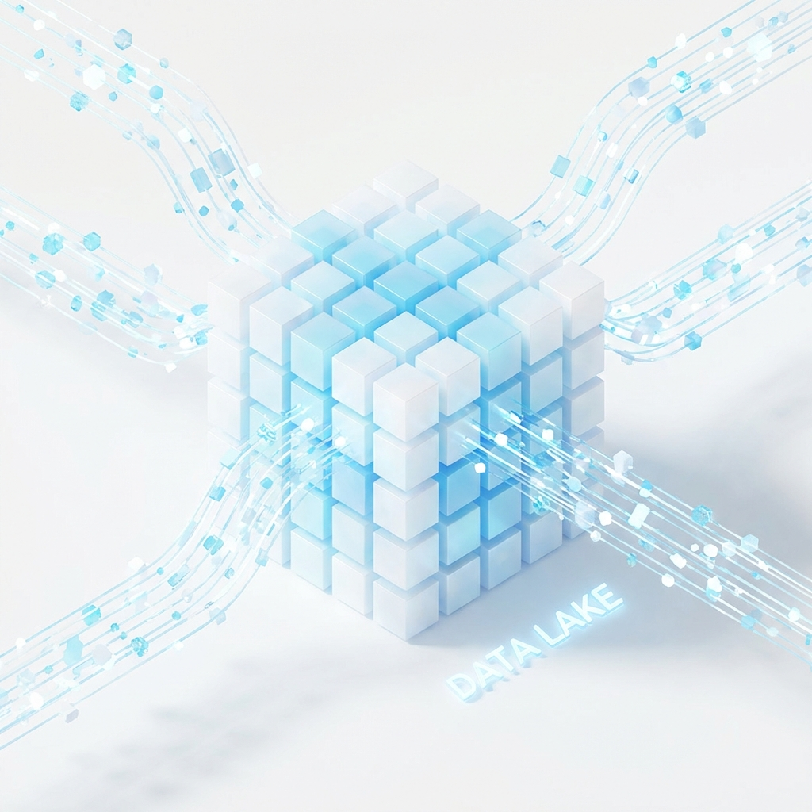
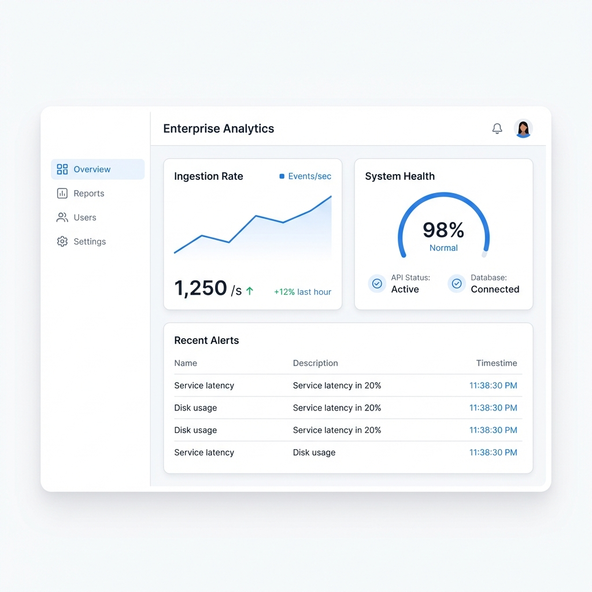
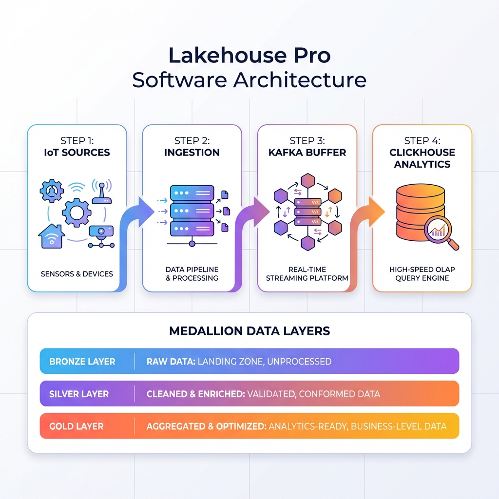

# 🚀 Lakehouse Pro

> **Enterprise-Grade Real-Time IoT Telemetry Pipeline & Analytics Dashboard**


**Lakehouse Pro** is a high-throughput, fault-tolerant telemetry pipeline designed to ingest, process, and visualize IoT sensor data in real-time. It leverages the **Medallion Architecture** to separate raw ingestion from enriched analytics, capable of handling 100k+ events/sec.



---

## ⚡ Quick Start

Get the entire stack running in under 2 minutes.

### 1. Start Infrastructure
```bash
docker-compose up -d --build
```

### 2. Start Dashboard
```bash
cd dashboard && npm run dev
```

### 3. Generate Traffic
```bash
# In a new terminal
cd backend && npm run simulate
```

> 🟢 **Access Dashboard**: [http://localhost:3000](http://localhost:3000)  
> 🔵 **Kafka UI**: [http://localhost:8086](http://localhost:8086)  
> 🟡 **ClickHouse UI**: [http://localhost:5521](http://localhost:5521) (Connect to Port 8124)

---

## 📸 Project Visuals

| **Real-Time Dashboard** | **System Workflow** |
| :---: | :---: |
|  |  |

---

## 🌟 Key Features

*   **🚀 Ultra-High Throughput**: Node.js/Kafka ingestion layer handling massive concurrency.
*   **📊 Sub-Second Analytics**: ClickHouse OLAP storage for instant aggregations over millions of rows.
*   **🛡️ Fault Tolerance**: Persistent buffering with Kafka ensures zero data loss during DB downtime.
*   **💎 Medallion Architecture**: Bronze (Raw), Silver (Valid), and Gold (Aggregated) data layers.
*   **🎨 Premium UI/UX**: Glassmorphism, Vortex animations, and responsive Aceternity UI components.

---

## 🏗️ System Architecture



The system follows a strict **Unidirectional Data Flow**:
1.  **Ingestion**: `Express` receives POST requests & validates schema.
2.  **Buffering**: `Kafka` decouples ingestion from storage (Shock Absorber).
3.  **Processing**: Consumer service writes clean execution batches to `ClickHouse`.
4.  **Presentation**: `Next.js` polls aggregated data for real-time visualization.

---

## 🧪 Testing & Verification

### Run Unit Tests
```bash
cd backend
npm test
```

### Chaos Testing
Refer to [Failure Scenarios](./docs/FAILURE_SCENARIOS.md) for network partition handling.

---

## 📚 Documentation

Detailed diagrams and decision logs are available in the `docs/` directory:

*   [**📂 Architecture Deep Dive**](./docs/ARCHITECTURE.md) - HLD, LLD, and Schema Definitions.
*   [**🛠️ Getting Started Guide**](./docs/GETTING_STARTED.md) - Detailed setup and prerequisites.
*   [**⚔️ Failure Scenarios**](./docs/FAILURE_SCENARIOS.md) - How we handle crashes and outages.
*   [**🎙️ Interview Q&A**](./docs/INTERVIEW_QA.md) - "Why ClickHouse?", "Why Node.js?", etc.

---

## 🛠️ Technology Stack

| Component | Technology | Role |
| :--- | :--- | :--- |
| **Ingestion** | Node.js v20 (Express) | High-performance API Gateway |
| **Queue** | Apache Kafka 7.5 | Durable Message Broker |
| **Storage** | ClickHouse 23.8 | Columnar OLAP Database |
| **Frontend** | Next.js 14 (App Router) | SSR & Client-side Polling |
| **Styling** | TailwindCSS + Aceternity | Modern Responsive Design |
| **DevOps** | Docker Compose | Container Orchestration |

---

## 🔮 Future Enhancements

*   **Authentication**: Implementing JWT/OIDC for secure API access.
*   **gRPC Support**: Moving internal communication to Protobufs for lower latency.
*   **Alerting**: Prometheus/Grafana integration for system monitoring.

---

## 📄 License

This project is licensed under the MIT License - see the [LICENSE](LICENSE) file for details.

---

## 👤 Author

**Harshan Aiyappa**  
Senior Full-Stack Hybrid AI Engineer  
Voice AI • Distributed Systems • Infrastructure

[](https://kimo-nexus.vercel.app/)
[](https://github.com/Kimosabey)
[](https://linkedin.com/in/harshan-aiyappa)
[](https://x.com/HarshanAiyappa)
