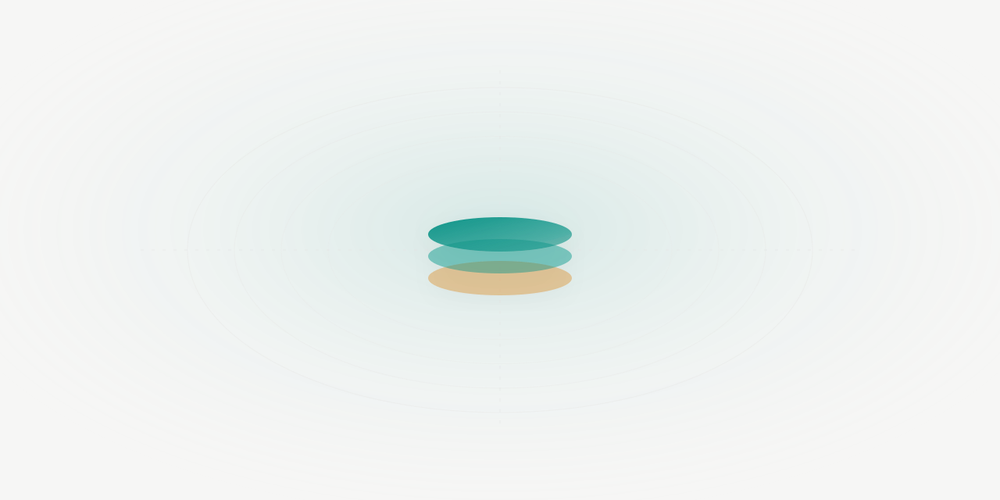
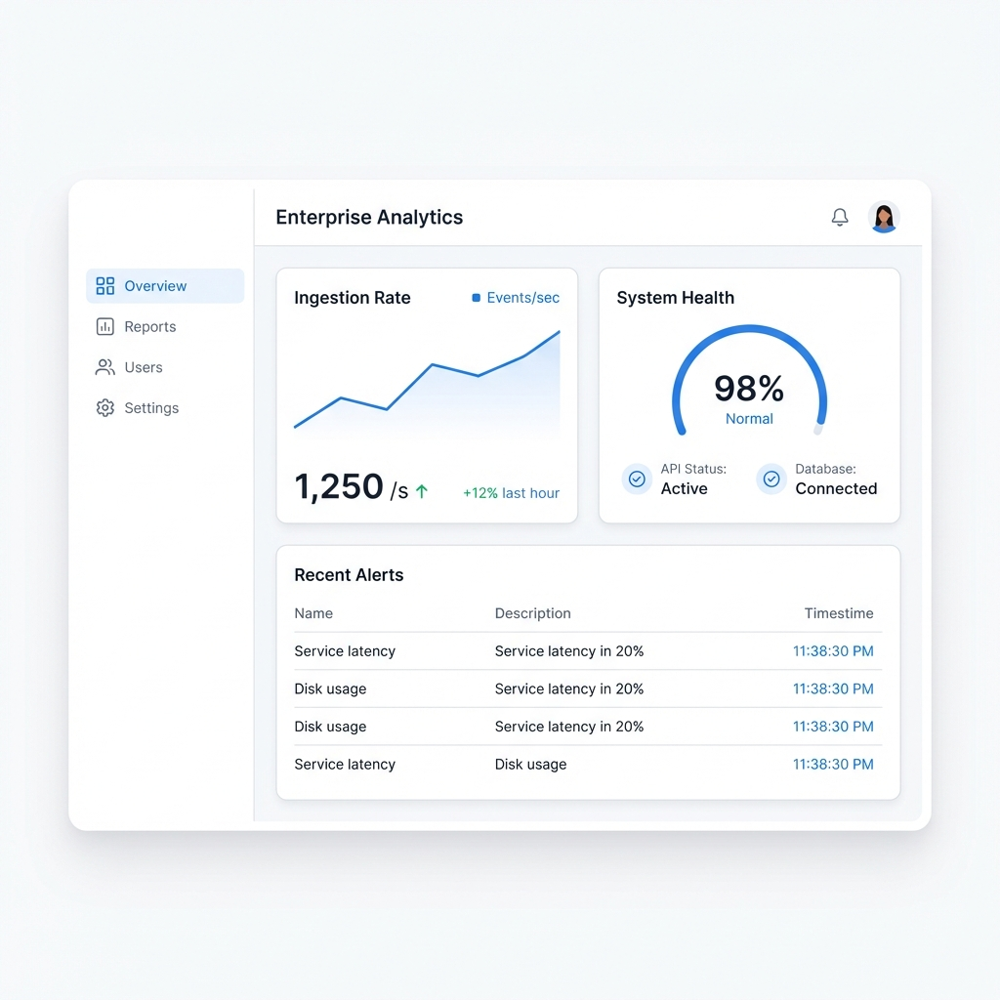
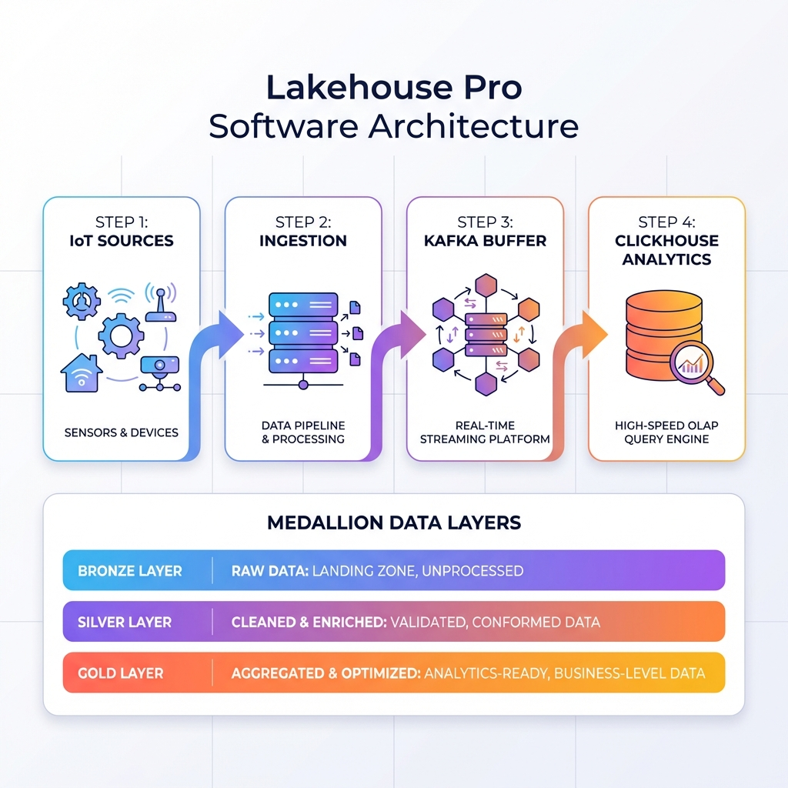
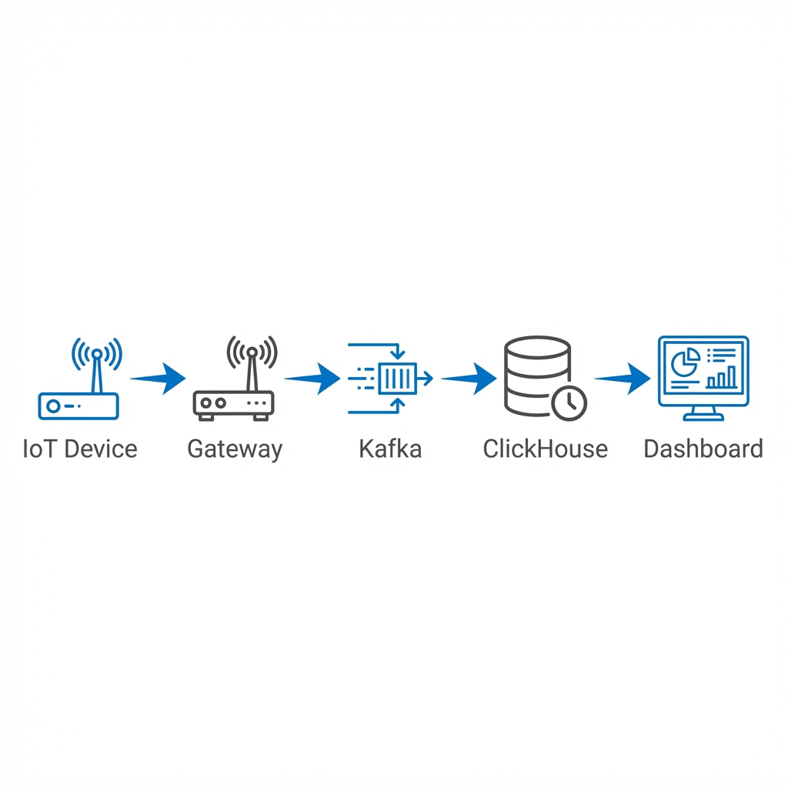

# Lakehouse Pro



## Enterprise-Grade Real-Time IoT Telemetry Pipeline & Analytics

<div align="center">


</div>

**Lakehouse Pro** is a high-throughput, fault-tolerant telemetry pipeline designed to ingest, process, and visualize IoT sensor data in real-time. It leverages the **Medallion Architecture** (Bronze, Silver, Gold) to separate raw ingestion from enriched analytics, capable of handling **100k+ events/sec** with sub-second query latency.

---

## 🚀 Quick Start

Launch the entire stack (Kafka + ClickHouse + Ingestion + Dashboard) in one command:

```bash
# 1. Start Infrastructure
docker-compose up -d --build

# 2. Generate Simulated Traffic
# In a new terminal
cd backend && npm run simulate
```

> **Detailed Setup**: See [GETTING_STARTED.md](./docs/GETTING_STARTED.md).

---

## 📸 Demo & Architecture

### Real-Time IoT Dashboard

*Visualizing 100k+ events with sub-second OLAP query performance.*

### System Architecture

*Medallion Architecture: Ingestion -> Kafka (Buffer) -> ClickHouse (OLAP).*

### Data Flow Workflow

*Unidirectional pipeline: Sensor -> Node.js -> Kafka -> Transformation -> Analytics.*

> **Deep Dive**: See [ARCHITECTURE.md](./docs/ARCHITECTURE.md) for the Schema and Medallion logic.

---

## ✨ Key Features

*   **🚀 Ultra-High Throughput**: Node.js/Kafka ingestion layer designed for massive concurrency.
*   **📊 Sub-Second Analytics**: **ClickHouse** columnar storage for instant aggregations over millions of rows.
*   **🛡️ Fault Tolerance**: Persistent buffering with Kafka ensures **Zero Data Loss** during DB maintenance.
*   **💎 Medallion Strategy**: Logical separation of data into Bronze (Raw), Silver (Filtered), and Gold (Aggregated).
*   **🎨 Premium UI/UX**: Built with Next.js 14, Aceternity UI, and Vortex animations.

---

## 🏗️ The Protective Journey

How data flows through the distributed system:

1.  **Ingest**: The Ingestion Gateway receives telemetry via HTTP POST.
2.  **Buffer**: Data is published to a Kafka topic, acting as a "Shock Absorber".
3.  **Process**: The Stream Processor (Bronze to Silver) validates and cleans the data.
4.  **Aggregate**: Materialized views in ClickHouse (Gold) prepare data for the UI.
5.  **Visualize**: The Next.js dashboard polls the Gold layer for real-time insights.

---

## 📚 Documentation

| Document | Description |
| :--- | :--- |
| [**System Architecture**](./docs/ARCHITECTURE.md) | HLD, LLD, ClickHouse Schema, and Medallion logic. |
| [**Getting Started**](./docs/GETTING_STARTED.md) | Setup guide, Docker environment, and Simulation scripts. |
| [**Failure Scenarios**](./docs/FAILURE_SCENARIOS.md) | Kafka partitions, DB recovery, and Circuit breakers. |
| [**Interview Q&A**](./docs/INTERVIEW_QA.md) | "Why ClickHouse?", "Why Kafka?", and "Medallion vs Vault". |

---

## 🔧 Tech Stack

| Component | Technology | Role |
| :--- | :--- | :--- |
| **Ingestion** | **Node.js (Express)** | High-performance API Gateway. |
| **Messaging** | **Apache Kafka** | Durable Event Streaming. |
| **Storage** | **ClickHouse** | Columnar OLAP Database. |
| **Frontend** | **Next.js 14** | Modern Real-time Analytics UI. |

---

## 👤 Author

**Harshan Aiyappa**  
Senior Full-Stack Hybrid AI Engineer  
Voice AI • Distributed Systems • Infrastructure

[](https://kimo-nexus.vercel.app/)
[](https://github.com/Kimosabey)
[](https://linkedin.com/in/harshan-aiyappa)
[](https://x.com/HarshanAiyappa)

---

## 📝 License

This project is licensed under the MIT License - see the [LICENSE](LICENSE) file for details.
